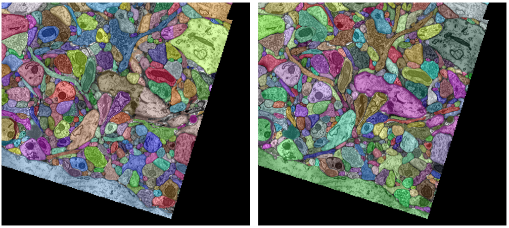

# Volume Segmentation Tool with GUI

This repository holds the script for Volume Segmentation Tool and its Gradio-based Webui.

Paper is available now: [A generalist deep-learning volume segmentation tool for volume electron microscopy of biological samples](https://www.sciencedirect.com/science/article/pii/S1047847725000498)

VST is also available with [SBGrid](https://sbgrid.org/software/titles/vst)!

Supporting Operating Systems includes: Windows and Linux.

(macOS is supported in theory, however some necessary PyTorch operations needed is not yet supported on MPS backend. Nothing I can do here.)

## About the Tool

Volume Segmentation Tool is a python based tool that utilizes deep learning to perform volumetric electron microscopy image segmentations, both semantic and instance segmentation.

Based on [Pytorch](https://pytorch.org/) backend. Includes a [Gradio](https://www.gradio.app/) based graphical user interface. 

The desired images are 8bit or 16bit grey scale 3D tif/hdf as commonly generated by electron microscopes. The desired labels are either binary mask where 0 is background and 1 is foreground (semantic), or each value represent a different object (instance).

This tool does __not__ support 2D image segmentation, nor colorful image segmentation. In which case you should consider [ilastik](https://www.ilastik.org/) 
or [Trainable Weka Segmentation](https://imagej.net/plugins/tws/), [nnU-Net](https://github.com/MIC-DKFZ/nnUNet) or [BiaPy](https://github.com/BiaPyX/BiaPy).

To contributor: The [GitHub page](https://github.com/fgdfgfthgr-fox/Volume_Seg_Tool) for VST is the preferred site for reporting issue or community feedback. 
For more information, please see the [CONTRIBUTING.md](CONTRIBUTING.md)


## Advantages

- High efficiency
  - Custom implemented augmentations specialised in volumetric images
  - Process many depth slices all once, rather than slice by slice
  - Support fp16/bf16 training
  - Up to 20x speedup compare to nnUNet
- Versatile
  - Semantic Segmentation & Instance Segmentation
  - Isotropic & anisotropic images
  - Adaptive network size for different dataset characteristics
  - Support AMD GPU (only under Linux)
  - Support large dataset - even larger than your system memory
- Easy to use
  - One click installation script
  - Graphical User Interface
  - Visualisation tools for data augmentation and network activations
  - Visualise network output on the fly
  - TensorBoard Logging & Can export as Excel spreadsheet

## Limitations

- Does not support 2D images, nor images with colours (grey scale only)
- Since it's based on Deep Learning, the tool needs to be used with a discrete GPU
  - Recommended minimal GPU requirement: 4GB of Video Memory, made by Nvidia or AMD
- Since it's based on Supervised Learning, the user has to create ground truth samples to train the network, before it could perform segmentation
  - For more information, please see [Tutorials](#tutorials).

## Installation

1. Install [Python 3.11](https://www.python.org/downloads/release/python-31113/). (Newer versions of Python should work as well)
   - During the installation process, ensure that you select the option to add Python to the 'PATH' environment variable.
2. Install [Git](https://git-scm.com/).
   - If you are using Linux, it's highly likely you can skip this step.
3. Open a terminal and navigate to the desired installation directory.
4. Clone the repository by running the following command:
   ```shell
   git clone https://github.com/fgdfgfthgr-fox/Volume_Seg_Tool.git
   ```
5. Run the corresponding "install_dependencies" script for your system.
   - For Windows, it would be install_dependencies_Windows.bat

6. Wait for the script to finish, which could take a while depends on your network speed.

7. To confirm the installation is successful, you should try to run the sanity check script.
   - For Windows, it would be sanity_check_Windows.bat

## Starting GUI

1. Run the corresponding "start_WebUI" script for your system. This would open up a terminal.
   - For Windows, it would be start_WebUI_Windows.bat
2. Your web browser should automatically open up a "website" with url "127.0.0.1:7860" or something similar.

## Tutorials

Please see the [Wiki](https://github.com/fgdfgfthgr-fox/Volume_Seg_Tool/wiki).

## Evaluation
VST has recently switched its network backbone from U-Net to Swin-transformer, 
providing lower VRAM requirement and slightly improved efficiency.

It achieves similar performance to [nnU-Net](https://github.com/MIC-DKFZ/nnUNet) while requiring far less time and memory.

All results obtained using a RTX 3080 GPU and Ryzen Threadripper 1950X CPU.

UroCell dataset:

(Size to spot feature set to 100, Training Duration of medium)

|                            | VST (from paper) | VST (Now)  | nnU-Net |
|----------------------------|------------------|------------|---------|
| Training time taken        | 2.0h             | 1.6h       | 20.4h   |
| Predict time taken         | 5.5s             | 7.2s       | 45s     |
| Peak VRAM use              | 6.6G             | 4.0G       | 6.0G    |
| Dice Score (higher better) | 0.8914           | __0.9132__ | 0.7990  |
| Sensitivity                | 0.8885           | 0.9104     | 0.6770  |
| Specificity                | 0.9967           | 0.9974     | 0.9995  |

Kasthuri connectomic:

(Size to spot feature set to 200, Training Duration of long)

|                     | VST (from paper) | VST (Now)  |
|---------------------|------------------|------------|
| Training time taken | 5.7h             | 6.9h       |
| Predict time taken  | 2min             | 2min       |
| Peak VRAM use       | 7.9G             | 6.3G       |
| True positive rate  | 0.6127           | __0.6414__ |
| False positive rate | 0.3862           | 0.3561     |
| False negative rate | 0.3876           | 0.3586     |
| Precision           | 0.6138           | 0.6439     |
| Recall              | 0.6124           | 0.6414     |



Right: Ground Truth of the test set. Left: VST prediction.

SARS-CoV-2 infected cell:

(Size to spot feature set to 120, Training Duration of medium)

|                            | VST (from paper) | VST (Now) | nnU-Net    |
|----------------------------|------------------|-----------|------------|
| Training time taken        | 1.8h             | 1.7h      | 46h        |
| Predict time taken         | 44s              | 50s       | 5.5min     |
| Peak VRAM use              | 10.0G            | 3.7G      | 6.9G       |
| Dice Score (higher better) | 0.9466           | 0.9574    | __0.9686__ |
| Sensitivity                | 0.9259           | 0.9572    | 0.9659     |
| Specificity                | 0.9994           | 0.9991    | 0.9993     |

## Credits

This tool was developed under the scholarship funding from [AgResearch](https://www.agresearch.co.nz/),
and was helped by the members of the [Bostina Lab](https://search.otago.ac.nz/s/search.html?collection=uoot-prod%7Esp-otago-search&profile=_default&query=bostina+lab) of the [University of Otago](https://www.otago.ac.nz/).
As well as Lech Szymanski from the school of computing.

The example dataset included in this repository was collected by [Vincent Casser](https://casser.io/connectomics/).

The [UroCell](https://github.com/MancaZerovnikMekuc/UroCell) Dataset was heavily used during the development of the tool.

Special thanks to YunBo Wang from [Xidian University](https://www.xidian.edu.cn/), who gave me exceptional helps at the early stage of development.
