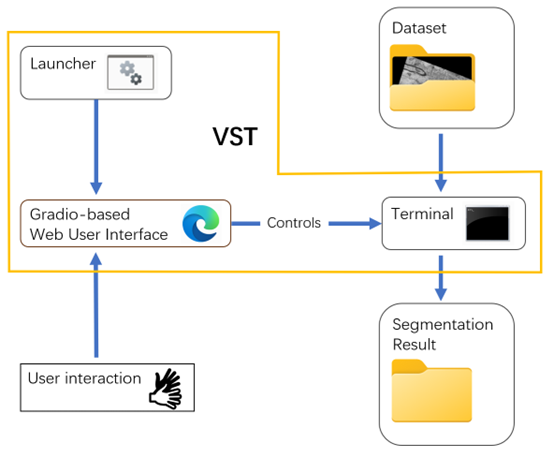
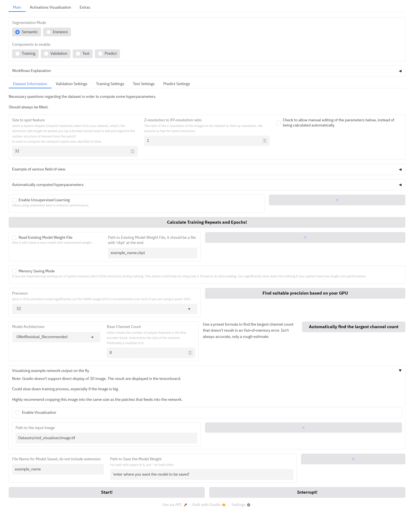

# Summary
Volume Segmentation Tool (VST) is a Python based deep learning tool designed specifically to segment three-dimensional VEM biological data without extensive requirements for cross disciplinary knowledge in deep learning. The tool is made accessible through a user-friendly interface with visualisations and a one-click installer.

Recognising the current rapid expansion of the VEM field, we have built VST with flexibility and instance segmentation in mind, hoping to ease and accelerate statistical analysis of large datasets in biological and medical research contexts. VST is composed of two main parts: the PyTorch[@paszke2019pytorch]-based deep learning core that performs semantic/instance segmentation on volumetric grey scale image datasets, and a user interface that operates on top of it, responsible for constructing CLI commands to the core components for tasking. The general pipeline of VST is shown in Figure 1. We had put in efforts to ensure VST could automatically handles issues associated with large dataset sizes, instance segmentation, anisotropic voxels and imbalanced classes.

VST has been used and tested mostly within a postgraduate project at the University of Otago, New Zealand, using serial block face scanning electron microscopy data from tissue, cell cultures and biobased materials (e.g., hair).  Using VST, we were able to automatically segment the full mitochondrial network from tumoursphere samples [@jadav2023beyond], providing valuable biological insight into tumour biology. There are also unpublished studies on wool follicles and wool fibres utilizing VST.

# Statement of need
Volume Electron Microscopy (VEM) enables the capture of 3D structure beyond planar samples, which is crucial for understanding biological mechanisms. With automation, improved resolution, and increased data storage capacity, VEM has led to an explosion of large three-dimensional datasets. Large datasets offer the opportunity to generate statistical data, but analysing them often requires assigning each voxel (3D pixel) to its corresponding structure, a process known as image segmentation. Manually segmenting hundreds or thousands of image slices is tedious and time-consuming. Computer-aided, especially Machine Learning (ML) based segmentation is now a routinely used method, with Trainable Weka Segmentation [@arganda2017trainable] and Ilastik [@berg2019ilastik] being two leading options. Emerging methods for EM image segmentation are often based on Deep Learning (DL) [@mekuvc2020automatic] because this approach has potential to outperform traditional ML in terms of accuracy and adaptivity [@minaee2021image][@erickson2019deep].

Our work was motivated by the lack of easy-to-use and adaptive DL tools specifically optimised for VEM image segmentation. Many studies in connectomics [@li2017compactness][@kamnitsas2017efficient], MRI [@milletari2016v] or X-ray tomography [@li2022auto] use a subject-optimised design at the cost of adaptability to non-target datasets. Nevertheless, there are some tools for more general VEM image DL segmentation. One example is CDeep3M [@haberl2018cdeep3m], which uses cloud computing. Although easy to use, it was designed for anisotropic data (where the z-resolution is much lower than xy-resolution) which creates limitations when applied to isotropic data [@gallusser2022deep]. Another example is DeepImageJ [@gomez2021deepimagej], which runs on local hardware and integrates easily with the ImageJ suit [@schneider2012nih]. However, it only supports pre-trained models and does not have the functionality to train new ones. ZeroCostDL4Mic [@von2021democratising] utilises premade notebooks running on Google Colab, but it requires user interaction during the entire segmentation process, which can take hours and thus is inconvenient. A more recent and advanced example is nnU-Net [@isensee2021nnu], which auto-configurates itself based on dataset properties and has a good support for volumetric dataset, but it focuses exclusively on semantic segmentation and lacks a user friendly interface. 

# The graphical user interface
VST's GUI is supported by the Gradio package [@abid2019gradio] and hosted on the user's browser.

The GUI is divided into three sections: Main, Activations Visualisation and Extras.

The main section (Figure 2) contains settings regarding training and using segmenting networks. Two segmentation modes are supported: semantic segmentation, in which the foreground objects are separated from the background, and instance segmentation, in which individual foreground objects are separated from each other as well. User can either train a new network, load an existing network and use it for predictions on new data, or train one and use it immediately.

Upon training, it automatically opens a Tensorboard interface [@pang2020deep] to provides various real time visualisations for the training process.

The activations visualisation section requires a trained network and an example image. Given that image, it plots the activation across each channel through all layers of the network.

The extra section contains two functionalities: exporting the TensorBoard log to an Excel table, calculating segmentation metrics between (potentially) generated labels and ground truth labels.

# Acknowledgements
We want to thank to: Rhodri Harfoot and Isa de Vries for providing the SARS-CoV-2 infected cells samples, Sai Velamoor and Laura Burga for tumoursphere preparations, Niki Hazelton and Richard Easingwood from the Otago Micro and Nano Imaging centre for data collection, Marina Richena for fruitful discussions.

# References